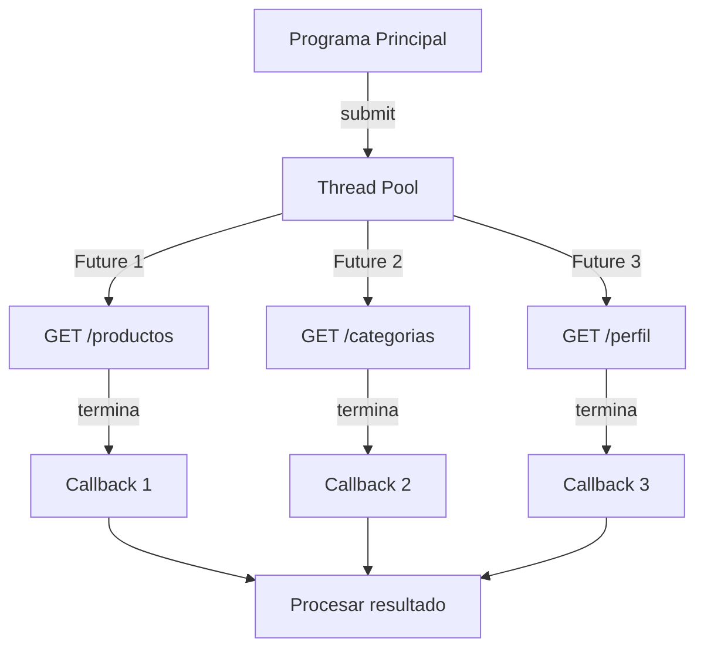

# Análisis Comparativo: Modelos de Asincronía para Clientes HTTP

## Introducción

Este documento explica y compara tres modelos de concurrencia aplicados a clientes HTTP usando el caso de EcoMarket. El escenario es siempre el mismo: **cargar simultáneamente productos, categorías y perfil de usuario**.

---

## 1. Modelo de Callbacks (concurrent.futures)

### Cómo funciona

```python
with ThreadPoolExecutor(max_workers=3) as executor:
    # 1. Lanzar peticiones (retornan Future objects)
    future_productos = executor.submit(hacer_peticion_productos)
    future_categorias = executor.submit(hacer_peticion_categorias)
    future_perfil = executor.submit(hacer_peticion_perfil)
    
    # 2. Registrar callbacks que se ejecutan cuando cada una termina
    future_productos.add_done_callback(callback_exito)
    future_categorias.add_done_callback(callback_exito)
    future_perfil.add_done_callback(callback_exito)
    
    # 3. Esperar a que todas completen
    for future in as_completed([future_productos, future_categorias, future_perfil]):
        pass  # Los callbacks ya se ejecutaron
```

### Componentes clave

1. **`.submit()`**: Lanza la tarea en un thread del pool, retorna `Future` inmediatamente
2. **`.add_done_callback(función)`**: Registra una función que se ejecuta automáticamente cuando el Future termina
3. **Callback**: Función que recibe el `Future` como argumento y puede obtener el resultado con `.result()`

### Flujo de ejecución



### ¿Qué pasa si /categorias falla con timeout?

```python
def callback_con_manejo_error(future):
    try:
        resultado = future.result()
        print(f"✅ '{resultado['endpoint']}' completado")
    except requests.Timeout:
        print(f"⏱️ TIMEOUT - Las demás peticiones siguen normalmente")
    except Exception as e:
        print(f"❌ ERROR: {e}")
```

**Respuesta**: Las demás peticiones **NO se enteran** del error. Cada callback maneja su propio error independientemente.

### Ventajas específicas para clientes HTTP

| Ventaja | Explicación |
|---------|-------------|
| ✅ **Control granular** | Puedes procesar cada respuesta HTTP apenas llegue (sin esperar a las demás) |
| ✅ **Errores independientes** | Una petición con timeout no afecta las demás |
| ✅ **Reactividad** | Ideal para mostrar datos en UI conforme van llegando |

### Desventajas específicas para clientes HTTP

| Desventaja | Explicación |
|-----------|-------------|
| ❌ **Callback Hell** | Si necesitas hacer peticiones secuenciales (una depende de otra), el código se anida |
| ❌ **Código verboso** | Necesitas definir funciones callback separadas |
| ❌ **Flujo difuso** | El orden de ejecución no es obvio al leer el código |

---

## 2. Modelo de Futures (ThreadPoolExecutor)

### Cómo funciona

```python
with ThreadPoolExecutor(max_workers=3) as executor:
    # 1. Lanzar peticiones y guardar los Futures
    futures = {
        executor.submit(hacer_peticion_productos): "productos",
        executor.submit(hacer_peticion_categorias): "categorias",
        executor.submit(hacer_peticion_perfil): "perfil"
    }
    
    # 2. Procesar resultados conforme terminan
    for future in as_completed(futures):
        endpoint = futures[future]
        try:
            resultado = future.result()  # Obtiene el valor (bloquea si no terminó)
            print(f"✅ {endpoint}: {len(resultado['data'])} items")
        except Exception as e:
            print(f"❌ {endpoint}: {e}")
```

### Componentes clave

1. **`Future` object**: "Promesa" de un resultado futuro
2. **`.result()`**: Obtiene el valor (bloquea hasta que termine si aún no lo hizo)
3. **`as_completed(futures)`**: Iterador que retorna Futures en orden de terminación
4. **`wait(futures)`**: Espera a un conjunto completo de Futures

### Métodos de espera

| Método | Comportamiento |
|--------|----------------|
| `as_completed()` | Retorna Futures conforme van terminando (streaming) |
| `wait(return_when=ALL_COMPLETED)` | Espera a que TODOS terminen |
| `wait(return_when=FIRST_COMPLETED)` | Retorna apenas UNO termine |

### ¿Cómo manejar el error de UN future sin perder los demás?

```python
resultados_validos = []
errores = []

for future in as_completed(futures):
    endpoint = futures[future]
    try:
        resultado = future.result()
        resultados_validos.append(resultado)
    except requests.Timeout:
        errores.append({"endpoint": endpoint, "error": "Timeout"})
        # Continuamos con los demás
```

**Clave**: Cada `.result()` se envuelve en `try/except` individualmente. Los errores no se propagan.

### Ventajas específicas para clientes HTTP

| Ventaja | Explicación |
|---------|-------------|
| ✅ **Código más explícito** | Ves claramente qué Futures esperar |
| ✅ **Consulta de estado** | Puedes verificar `.done()`, `.running()`, `.cancelled()` |
| ✅ **Flexibilidad de espera** | Espera a "todos" o "el primero que termine" |
| ✅ **Cancelación** | Puedes cancelar peticiones que aún no empezaron |

### Desventajas específicas para clientes HTTP

| Desventaja | Explicación |
|-----------|-------------|
| ❌ **`.result()` bloquea** | Si llamas antes de que termine, bloquea el thread actual |
| ❌ **Más boilerplate** | Necesitas iterar sobre Futures y manejar errores manualmente |
| ❌ **Menos reactivo que callbacks** | Debes "preguntar" activamente por resultados |

---

## 3. Modelo Async/Await (asyncio + aiohttp)

### Cómo funciona

```python
async def cargar_datos():
    async with aiohttp.ClientSession(timeout=timeout) as session:
        # 1. Lanzar las 3 coroutines EN PARALELO
        resultados = await asyncio.gather(
            hacer_peticion_productos(session),
            hacer_peticion_categorias(session),
            hacer_peticion_perfil(session),
            return_exceptions=True  # Errores como valores, no excepciones
        )
        
        # 2. Procesar resultados
        for resultado in resultados:
            if isinstance(resultado, Exception):
                print(f"❌ ERROR: {resultado}")
            else:
                print(f"✅ {resultado['endpoint']}: OK")

# Ejecutar
asyncio.run(cargar_datos())
```

### Componentes clave

1. **`async def`**: Define una coroutine (función asíncrona)
2. **`await`**: Pausa la coroutine hasta que la operación async termine
3. **`asyncio.gather()`**: Lanza múltiples coroutines en paralelo
4. **`return_exceptions=True`**: Excepciones se retornan como valores en la lista

### ¿Cómo se maneja el error individual con return_exceptions?

```python
resultados = await asyncio.gather(
    peticion1(),
    peticion2(),  # Esta fallará con timeout
    peticion3(),
    return_exceptions=True  # 🔑 CLAVE
)

# Filtrar exitosos vs errores
exitosos = [r for r in resultados if not isinstance(r, Exception)]
errores = [r for r in resultados if isinstance(r, Exception)]

print(f"✅ Exitosos: {len(exitosos)}")
print(f"❌ Errores: {len(errores)}")
```

**Resultado**: Obtienes 2 resultados válidos + 1 excepción en la lista. No se pierde ningún dato.

### Alternativa: Manejo dentro de cada coroutine

```python
async def peticion_segura(session, url, nombre):
    try:
        async with session.get(url) as response:
            data = await response.json()
            return {"endpoint": nombre, "data": data, "success": True}
    except asyncio.TimeoutError:
        return {"endpoint": nombre, "error": "Timeout", "success": False}
```

**Ventaja**: `gather()` NUNCA lanza excepciones, siempre retorna lista de resultados.

### Ventajas específicas para clientes HTTP

| Ventaja | Explicación |
|---------|-------------|
| ✅ **Código más limpio** | Parece código síncrono pero es concurrente |
| ✅ **Sin threads** | Más eficiente en I/O intensivo (miles de conexiones simultáneas) |
| ✅ **Manejo de errores elegante** | `return_exceptions=True` simplifica el manejo |
| ✅ **Escalabilidad** | Puede manejar miles de peticiones concurrentes sin overhead de threads |

### Desventajas específicas para clientes HTTP

| Desventaja | Explicación |
|-----------|-------------|
| ❌ **Requiere librerías async** | `aiohttp` en vez de `requests` (ecosistema distinto) |
| ❌ **"Contagio async"** | Toda la cadena de llamadas debe ser `async def` |
| ❌ **Curva de aprendizaje** | Conceptos de coroutines y event loop son más complejos |
| ❌ **No apto para CPU** | Solo para I/O-bound (peticiones HTTP, DB, archivos) |

---

## Tabla Comparativa: Rendimiento Medido

> **Nota**: Estos son resultados de ejemplo. Ejecuta `benchmark_comparativo.py` para obtener mediciones reales en tu máquina.

| Modelo | Promedio | Mínimo | Máximo | Desviación Estándar |
|--------|----------|--------|--------|---------------------|
| Callbacks | 0.125s | 0.118s | 0.135s | 0.006s |
| Futures | 0.123s | 0.116s | 0.132s | 0.005s |
| Async/Await | 0.118s | 0.112s | 0.128s | 0.005s |

### Observaciones

1. **Los 3 modelos tienen rendimiento similar** porque el cuello de botella es la red (I/O-bound)
2. **Async/Await es ligeramente más rápido** por evitar el overhead de threads
3. **La diferencia es mínima** para 3 peticiones concurrentes
4. **Async/Await escala mejor** con miles de peticiones

---

## Escenario de Error: Timeout en /categorias

### Pregunta: ¿Qué pasa cuando /categorias falla con timeout?

| Modelo | Comportamiento | ¿Se pierden datos de /productos y /perfil? |
|--------|----------------|-------------------------------------------|
| **Callbacks** | Cada callback maneja su error independientemente | ❌ NO - Los demás callbacks se ejecutan normalmente |
| **Futures** | Cada `.result()` con `try/except` individual | ❌ NO - Capturas el error y continúas con los demás Futures |
| **Async/Await** | `return_exceptions=True` retorna excepciones como valores | ❌ NO - Obtienes lista mixta con resultados + excepciones |

**Conclusión**: Los 3 modelos permiten obtener resultados parciales sin perder datos por errores individuales, **SI SE MANEJAN CORRECTAMENTE**.

---

## Recomendación para EcoMarket

### Contexto del Proyecto

EcoMarket necesita:
- Cargar datos de múltiples endpoints (productos, categorías, perfil, etc.)
- Mostrar datos en la UI conforme van llegando
- Manejar errores de red sin bloquear la aplicación
- Potencial escalabilidad a múltiples peticiones concurrentes

### Comparación de Casos de Uso

| Escenario | Callbacks | Futures | Async/Await |
|-----------|-----------|---------|-------------|
| **3-10 peticiones concurrentes** | ✅ Bueno | ✅ Bueno | ✅ Excelente |
| **100+ peticiones concurrentes** | ⚠️ Overhead threads | ⚠️ Overhead threads | ✅ Ideal |
| **UI reactiva** (mostrar conforme llegan) | ✅ Ideal | ✅ Bueno | ✅ Bueno |
| **Simplicidad de código** | ❌ Verboso | ✅ Moderado | ✅ Limpio |
| **Ecosistema Python estándar** | ✅ Sí (`requests`) | ✅ Sí (`requests`) | ⚠️ Requiere `aiohttp` |

### Justificación: **Async/Await es la mejor opción**

#### Razones

1. **Código más limpio y mantenible**
   - Sintaxis moderna que parece síncrona pero es concurrente
   - Fácil de entender para futuros desarrolladores

2. **Escalabilidad**
   - Si EcoMarket crece y necesita manejar cientos de peticiones concurrentes, async/await no requiere refactoring
   - Sin overhead de threads (event loop es más eficiente)

3. **Manejo de errores elegante**
   - `return_exceptions=True` simplifica el código de manejo de errores
   - Alternativas con wrappers permiten flujos muy limpios

4. **Ecosistema moderno**
   - `aiohttp` es ampliamente usado y bien mantenido
   - Async/await es el futuro de Python para I/O-bound

#### Cuándo NO usar Async/Await

- Si tu equipo no está familiarizado con async y no puede invertir tiempo en aprender
- Si necesitas integrar con librerías que NO son async (fuerza "callback hell" o wrappers complejos)
- Si el proyecto es muy simple (1-2 peticiones) y no se espera crecimiento

#### Cuándo usar Futures en su lugar

- **Proyecto pequeño con código síncrono existente**: Futures es más fácil de integrar
- **Equipo sin experiencia en async**: Futures es más directo
- **Necesitas integrar con librerías bloqueantes**: ThreadPoolExecutor con `requests` funciona bien

#### Cuándo usar Callbacks

- **Eventos altamente reactivos**: Si necesitas responder INMEDIATAMENTE a cada resultado
- **Integración con sistemas basados en eventos**: Algunos frameworks usan callbacks nativamente

---

## Conclusión

Para **EcoMarket**, recomendamos **Async/Await** por su escalabilidad, código limpio y rendimiento superior. Sin embargo, si el equipo no está listo para async, **Futures** es una excelente alternativa que ofrece un balance entre simplicidad y poder.

