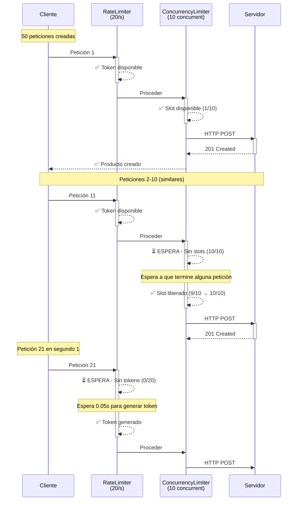
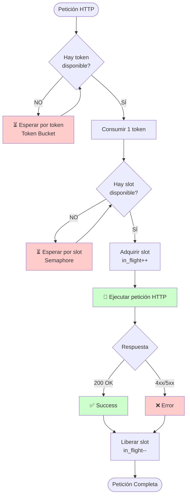
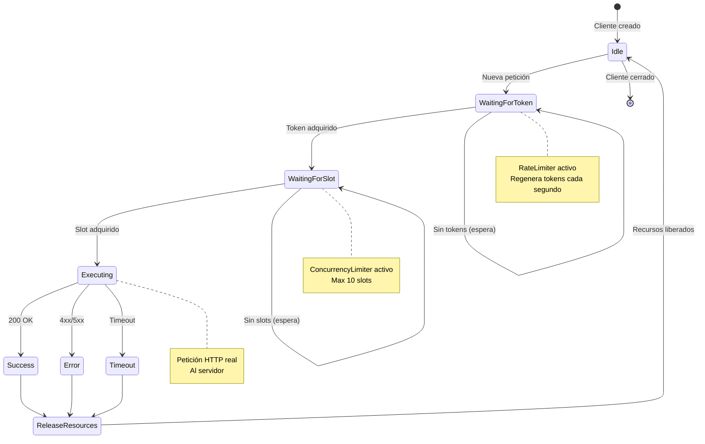

# Diagramas Temporales - Sistema de Throttling

Este documento visualiza el comportamiento del sistema de control de tráfico usando diagramas temporales en formato ASCII y Mermaid.

## 1. Flujo Sin Throttling (Problema)

```
Tiempo (segundos) →
0     1     2     3     4     5
|-----|-----|-----|-----|-----|

Cliente lanza 100 peticiones:
R1  ████████████████████ (ERROR: timeout)
R2  ████████████████████ (ERROR: timeout)
R3  ████████████████████ (ERROR: timeout)
...
R100 ███████████████████ (ERROR: timeout)

Servidor (límite: 20 conexiones):
Conexiones: ████████████████████ SATURADO! 💥
File descriptors: ████████████ AGOTADOS! 💥
Rate limit: ████████████████████ VIOLADO! 💥

❌ Resultado:
- 100 peticiones simultáneas
- Servidor sobrecargado
- Errores de conexión
- Violación de rate limits
```

## 2. Flujo Con ConcurrencyLimiter (max_concurrent=10)

```
Tiempo (segundos) →
0     1     2     3     4     5
|-----|-----|-----|-----|-----|

Lote 1 (peticiones 1-10):
R1   ██████ ✓
R2   ██████ ✓
R3   ██████ ✓
...
R10  ██████ ✓

      Lote 2 (peticiones 11-20):
      R11  ██████ ✓
      R12  ██████ ✓
      ...
      R20  ██████ ✓

            Lote 3 (peticiones 21-30):
            R21  ██████ ✓
            ...

Peticiones en vuelo:
0s:  10 ████████ (límite: 10) ✅
1s:  10 ████████ (límite: 10) ✅
2s:  10 ████████ (límite: 10) ✅
3s:  10 ████████ (límite: 10) ✅
4s:  10 ████████ (límite: 10) ✅

✅ Resultado:
- Nunca más de 10 peticiones simultáneas
- Servidor no se sobrecarga
- File descriptors bajo control
```

## 3. Flujo Con RateLimiter (max_per_second=20)

```
Token Bucket (capacidad: 20 tokens):

Segundo 0:
Bucket: [🪙🪙🪙🪙🪙🪙🪙🪙🪙🪙🪙🪙🪙🪙🪙🪙🪙🪙🪙🪙] (20 tokens)
Peticiones 1-20 consumen tokens:
R1-R20: ✅ Ejecutan inmediatamente
Bucket: [____________________] (0 tokens)

Segundo 0.5:
Petición 21 llega:
Bucket: [__________] (10 tokens regenerados)
R21: ⏳ ESPERA 0.5s por token
R21: ✅ Ejecuta cuando llega token

Segundo 1:
Bucket: [🪙🪙🪙🪙🪙🪙🪙🪙🪙🪙🪙🪙🪙🪙🪙🪙🪙🪙🪙🪙] (regenera a 20)
Peticiones 22-41 consumen tokens:
R22-R41: ✅ Ejecutan
Bucket: [____________________] (0 tokens)

Segundo 2:
Bucket regenera...
...

✅ Resultado:
- Máximo 20 peticiones por segundo
- Rate limit respetado
- Peticiones esperan sin fallar
```

## 4. Flujo Combinado (ConcurrencyLimiter + RateLimiter)



## 5. Visualización de Peticiones en Vuelo

```
Peticiones en Vuelo vs Tiempo

12 |                                        Límite (max=10)
   |                    ..........................................
10 |     █████████████████████████████
   |    ██                          ██
8  |   ██                            ██
   |  ██                              ██
6  | ██                                ██
   |██                                  ██
4  |█                                    ██
   |                                      ██
2  |                                       ██
   |                                         █
0  |___________|___________|___________|____█___|
   0s          1s          2s          3s    4s

Leyenda:
█ = Peticiones en ejecución
. = Límite configurado (10)

✅ Observación: La línea nunca excede el límite
```

## 6. Visualización de Rate Limiting

```
Peticiones por Segundo

25 |                                   Límite (max=20)
   |                    ..........................................
20 |  ████  ████  ████  ████
   |  ████  ████  ████  ████
15 |  ████  ████  ████  ████
   |  ████  ████  ████  ████
10 |  ████  ████  ████  ████
   |  ████  ████  ████  ████
5  |  ████  ████  ████  ████
   |  ████  ████  ████  ████
0  |__|____|__|____|__|____|__|____
   0s  1s  2s  3s  4s  5s  6s

Leyenda:
████ = Peticiones ejecutadas en ese segundo
.... = Límite configurado (20/s)

✅ Observación: Ninguna barra excede el límite
```

## 7. Orden de Aplicación de Limitadores



## 8. Token Bucket Algorithm - Paso a Paso

```
Estado Inicial:
═══════════════════════════════════
Bucket: [🪙🪙🪙🪙🪙🪙🪙🪙🪙🪙] (10/10 tokens)
Rate: 10 tokens/segundo
Time: 0.0s

Petición 1 llega (t=0.0s):
───────────────────────────────────
¿Hay tokens? SÍ (10 disponibles)
Consumir 1 token
Bucket: [🪙🪙🪙🪙🪙🪙🪙🪙🪙_] (9/10)
✅ Ejecutar petición

Peticiones 2-10 llegan (t=0.0s):
───────────────────────────────────
Consumen tokens restantes
Bucket: [__________] (0/10)
✅ Todas ejecutan

Petición 11 llega (t=0.0s):
───────────────────────────────────
¿Hay tokens? NO (0 disponibles)
⏳ ESPERAR por token

Time avanza a t=0.1s:
═══════════════════════════════════
Tiempo transcurrido: 0.1s
Tokens generados: 0.1s × 10/s = 1 token
Bucket: [🪙_________] (1/10)
✅ Petición 11 puede proceder

Rafaga de 15 peticiones (t=1.0s):
═══════════════════════════════════
Bucket al inicio: [🪙🪙🪙🪙🪙🪙🪙🪙🪙🪙] (10/10)
Primeras 10: Ejecutan inmediatamente
Bucket: [__________] (0/10)
Siguientes 5: Esperan
  - Espera ~0.1s cada una
  - Conforme se generan tokens

Time avanza a t=2.0s:
═══════════════════════════════════
Bucket regenera completamente
Bucket: [🪙🪙🪙🪙🪙🪙🪙🪙🪙🪙] (10/10)
Listo para nueva rafaga
```

## 9. Comparación de Métricas

### Sin Throttling

```
Tiempo total: 2.5s
Throughput: 40 req/s ⚡
Errores: 23/50 ❌
Peticiones concurrentes máx: 50 💥

Gráfica de errores:
████████████████████████ (48% errores)
```

### Con Throttling

```
Tiempo total: 3.2s
Throughput: 15.6 req/s ✅
Errores: 0/50 ✅
Peticiones concurrentes máx: 10 ✅

Gráfica de errores:
(sin errores) ✅
```

**Conclusión**: El throttling aumenta ligeramente el tiempo total, pero **elimina errores** y garantiza uso controlado de recursos.

## 10. Diagrama de Estados del Sistema



## 11. Ejemplo Real de Ejecución

```
LOG: Ejecución de 20 peticiones con limits (concurrent=5, rate=10/s)

T=0.000s │ [REQUEST  1] RateLimiter: token acquired (0.000s wait)
T=0.001s │ [REQUEST  1] ConcurrencyLimiter: slot acquired (1/5 in-flight)
T=0.001s │ [REQUEST  1] HTTP POST /productos → STARTED

T=0.002s │ [REQUEST  2] RateLimiter: token acquired (0.000s wait)
T=0.003s │ [REQUEST  2] ConcurrencyLimiter: slot acquired (2/5 in-flight)
T=0.003s │ [REQUEST  2] HTTP POST /productos → STARTED

T=0.004s │ [REQUEST  3] RateLimiter: token acquired (0.000s wait)
T=0.005s │ [REQUEST  3] ConcurrencyLimiter: slot acquired (3/5 in-flight)
...
T=0.015s │ [REQUEST  5] ConcurrencyLimiter: slot acquired (5/5 in-flight) ⚠️

T=0.016s │ [REQUEST  6] RateLimiter: token acquired (0.000s wait)
T=0.017s │ [REQUEST  6] ConcurrencyLimiter: WAITING (5/5 in-flight) ⏳

T=0.250s │ [REQUEST  1] HTTP POST /productos → 201 CREATED ✅
T=0.251s │ [REQUEST  1] ConcurrencyLimiter: slot released (4/5 in-flight)

T=0.252s │ [REQUEST  6] ConcurrencyLimiter: slot acquired (5/5 in-flight)
T=0.253s │ [REQUEST  6] HTTP POST /productos → STARTED

...

T=1.000s │ [TOKEN BUCKET] Regenerated 10 tokens
T=1.001s │ [REQUEST 11] RateLimiter: token acquired (0.000s wait)
T=1.002s │ [REQUEST 11] ConcurrencyLimiter: slot acquired (5/5 in-flight)

...

T=2.500s │ [SUMMARY]
           ├─ Total requests: 20
           ├─ Successful: 20 ✅
           ├─ Failed: 0
           ├─ Max concurrent observed: 5/5 ✅
           ├─ Max rate observed: 10/10 per second ✅
           └─ Average wait time: 0.045s
```

## 12. Conclusiones Visuales

### ✅ Comportamiento Correcto

```
Concurrencia:     ████████ (respeta límite)
Rate:             ████████ (respeta límite)
Errores:          (ninguno) ✅
Recursos:         (controlados) ✅
```

### ❌ Sin Throttling

```
Concurrencia:     ████████████████████████ (excede límite) 💥
Rate:             ████████████████████████ (excede límite) 💥
Errores:          ████████████ (muchos) ❌
Recursos:         (agotados) 💥
```

---

**Todos los diagramas son generados automáticamente por el sistema de monitoreo y guardados como imágenes PNG con matplotlib.**
